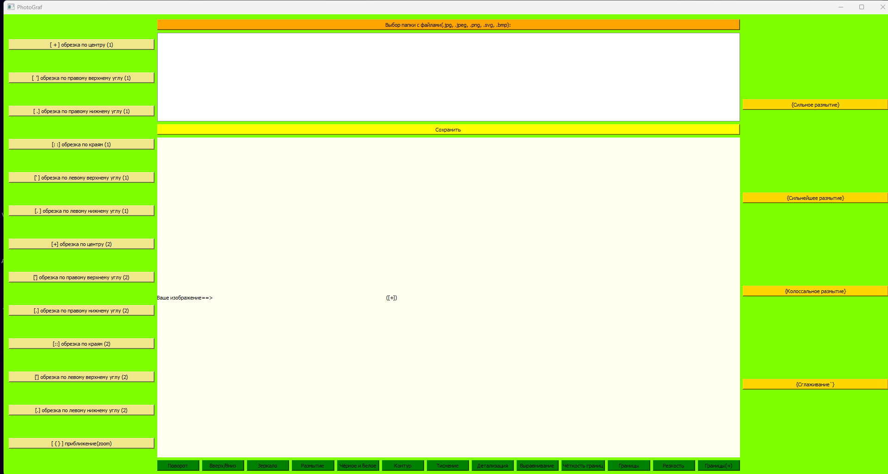

Фото редактор "PhotoGraf" пприложение

Это моё первое приложение написанное на python с использованием билиотеки pyqt5.
Не судите строго!)

Этот проект я писал уже давно. К сожалению была утеряна небольшая часть кода, которая управляла 3 кнопками для редактирования фото, но сам исполняемый exe файл остался.
PhotoGraf может редактировать фото с расширениями(png, jpg, bmp, jpeg, svg)

Чтобы отредактировать фото достаточно выбрать одну папку с фото и после редактирования фото автоматически сохраняется в подпапку "Modified images".

Это фото интерфейса фоторедактора на котором присутствует те самые 3 кнопки код которых был утерян(

Требования:

1) pqt5 library (pip install pyqt5)
2) pillow library (pip install pillow)
3) tkinter library (pip install tkinter)->!не обязательно!
